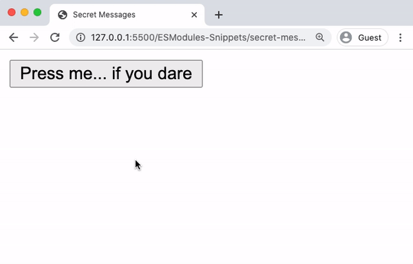
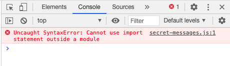

# Implementing Modules using ES6 Syntax

## A Brief History of JavaScript Modules in the Browser
In the early days of web development, JavaScript usage was fairly minimal. A script here to add some interactivity to a page and a script there to automate away some simple task. Nowadays, however, JavaScript dominates the web and scripts have ballooned into large and cumbersome behemoths. According to some studies, the average size of a website, in terms of kilobytes of JavaScript data transferred, [has grown over 5 times from 2010 to 2020](https://httparchive.org/reports/state-of-javascript?start=earliest&end=latest&view=list).

These stats aren’t meant to paint a dreary future of web development. Web applications drive much of modern society and are far more capable than could have been imagined when the World Wide Web was created in 1989. Instead, it is to make clear the need for modularity as the capabilities, and size, of these scripts grow.

Though libraries for implementing modules have existed for some time, syntax for natively implementing modules was only introduced in 2015 with the release of [ECMAScript 6 (ES6)](http://es6-features.org/#ValueExportImport). Since then, it has been adopted by most modern browsers and is the de facto approach for implementing modular applications in the browser.

## Implementing Modules in the Browser
Let’s take a look at implementing modules in the browser through an example. Suppose you wanted to build a simple web application with some hidden text that is revealed when a button is pressed.


To create this website, you could create two files, **secret-messages.html** and **secret-messages.js**, and store them together in a folder called **secret-messages**:
```
secret-messages/
|-- secret-messages.html
|-- secret-messages.js
```
Let’s take a look at the HTML file first:
```
<!-- secret-messages.html --> 
<html>
  <head>
    <title>Secret Messages</title>
  </head>
  <body>
    <button id="secret-button"> Press me... if you dare </button>
    <p id="secret-p" style="display: none"> Modules are fancy! </p>
    <script src="./secret-messages.js"> </script>
  </body>
</html>
```
- The **secret-messages.html** page renders a button element and a hidden paragraph element.
- It then loads the script **secret-messages.js** using the [file path](https://www.geeksforgeeks.org/html-file-paths/) `"./secret-messages.js"`. The `./` before the file name is how you indicate that the file being referenced (**secret-messages.js**) is in the same folder as the file referencing it (**secret-messages.html**).

Here is the JavaScript file:
```
/* secret-messages.js */
const buttonElement = document.getElementById('secret-button');
const pElement = document.getElementById('secret-p');
 
const toggleHiddenElement = (domElement) => {
    if (domElement.style.display === 'none') {
      domElement.style.display = 'block';
    } else {
      domElement.style.display = 'none';
    }
}
 
buttonElement.addEventListener('click', () => {
  toggleHiddenElement(pElement);
});
```

- In **secret-messages.js**, [DOM](https://developer.mozilla.org/en-US/docs/Web/API/Document_Object_Model/Introduction) objects are created to reference the button element and paragraph element using the [DOM API](https://developer.mozilla.org/en-US/docs/Web/API/Document/getElementById). These objects are stored in `buttonElement` and `pElement`, respectively.
- The function `toggleHiddenElement()` is declared. It can accept either of these elements as an input called `domElement` and will either show or hide that element depending on its current `style.display` value.
- An event listener is added to `buttonElement` to listen for `'click'` events and respond by calling `toggleHiddenElement()` with `pElement` as the argument.

Now, suppose you wanted to create a second webpage with similar features. There is still a button, but this time clicking it reveals an image. Using similar logic as the program above, this can be achieved with the following file structure:
```
secret-image/
|-- secret-image.html
|-- secret-image.js
```
The HTML might look like this:
```
<!-- secret-image.html --> 
<html>
  <head>
    <title>Secret Image</title>
  </head>
  <body>
    <button id="secret-button"> Want to see something cool? </button>
    
    <script src="./secret-image.js"> </script>
  </body>
</html>
```
… and the JavaScript might look like this:
```
/* secret-image.js */
const buttonElement = document.getElementById('secret-button');
const imgElement = document.getElementById('secret-img');
 
const toggleHiddenElement = (domElement) => {
    if (domElement.style.display === 'none') {
      domElement.style.display = 'block';
    } else {
      domElement.style.display = 'none';
    }
}
 
buttonElement.addEventListener('click', () => {
  toggleHiddenElement(imgElement);
});
```
Given that much of the code in these two programs is similar, creating this second website was fairly straightforward. In particular, notice that the `toggleHiddenElement()` function is copied line for line from **secret-messages.js**.

Having two identical, but separate, copies of a function can lead to maintenance issues in the future. For example, any bugs that may exist within the function would need to be fixed in two places rather than one.

Instead, creating a single copy of `toggleHiddenElement()` within a module that *exports* it would allow these two websites to *import* and use the exact same function. With this approach, updates to the function only need to occur within the module that defines them, and all programs that import this function will receive the same update. Furthermore, additional functions could be exported by the module and used by both programs, further reducing repetition.

## ES6 Named Export Syntax
A module must be entirely contained within a file. So, let’s first consider where a new module may be placed within the file system. Since it needs to be used by both of these projects, you may want to put it in a mutually accessible location. The entire file structure containing both projects and this new module, let’s call it **dom-functions.js**, could look like this:
```
secret-image/
|-- secret-image.html
|-- secret-image.js
secret-messages/
|-- secret-messages.html
|-- secret-messages.js
modules/
|-- dom-functions.js    <-- new module file
```
Inside **dom-functions.js**, the functions you wish to reuse can be exported using the *named export* syntax below:
```
export { resourceToExportA, resourceToExportB, ...}
```
Using this syntax, the name of each exported resource is listed between curly braces and separated by commas. Below, you can see how this is implemented in the new module file dom-functions.js:
```
/* dom-functions.js */
const toggleHiddenElement = (domElement) => {
    if (domElement.style.display === 'none') {
      domElement.style.display = 'block';
    } else {
      domElement.style.display = 'none';
    }
}
 
const changeToFunkyColor = (domElement) => {
  const r = Math.random() * 255;
  const g = Math.random() * 255;
  const b = Math.random() * 255;
 
  domElement.style.background = `rgb(${r}, ${g}, ${b})`;
}
 
export { toggleHiddenElement, changeToFunkyColor };
```
Let’s briefly break down how this module works:

- The function `toggleHiddenElement()` is declared. It accepts a `domElement` as an input and either shows or hides that element depending on its current display style value.
- A new function `changeToFunkyColor()` is declared. It accepts a `domElement` as an input and then sets its background color to a random [`rgb()` color value](https://www.w3schools.com/colors/colors_rgb.asp).
- The two functions are exported using the ES6 `export` statement.

These exported functions are now available to be imported and used by other files.

In addition to the syntax above, in which all named exports are listed together, individual values may be exported as named exports by simply placing the export keyword in front of the variable’s declaration. Here is the same example using this syntax:
```
/* dom-functions.js */
export const toggleHiddenElement = (domElement) => {
  // logic omitted...
}
 
export const changeToFunkyColor = (domElement) => {
  // logic omitted...
}
```

## ES6 Import Syntax
The ES6 syntax for importing named resources from modules is similar to the `export` syntax:
```
import { exportedResourceA, exportedResourceB } from '/path/to/module.js';
```
Let’s update the **secret-messages** program such that it now imports functionality from **dom-functions.js**. Doing so requires two important steps. First, update **secret-messages.js**:
```
/* secret-messages.js */
import { toggleHiddenElement, changeToFunkyColor } from '../modules/dom-functions.js';
 
const buttonElement = document.getElementById('secret-button');
const pElement = document.getElementById('secret-p');
 
buttonElement.addEventListener('click', () => {
  toggleHiddenElement(pElement);
  changeToFunkyColor(buttonElement);
});
```

- In **secret-messages.js**, the functions `toggleHiddenElement()` and `changeToFunkyColor()` are imported from the module **../modules/dom-functions.js**. The `../` indicates that the **modules/** folder is in the same folder as the parent folder, **secret-messages/**.
- When the button is clicked, the now imported `toggleHiddenElement()` function is called with `pElement` as an argument.
- In addition, `changeToFunkyColor()` is called with `buttonElement` as an argument, changing its background color to a random one.

Now, you must also update secret-messages.html:
```
<!-- secret-messages.html --> 
<html>
  <head>
    <title>Secret Messages</title>
  </head>
  <body>
    <button id="secret-button"> Press me... if you dare </button>
    <p id="secret-p" style="display: none"> Modules are fancy! </p>
    <script type="module" src="./secret-messages.js"> </script>
  </body>
</html>
```

The change here is subtle, can you spot it? In **secret-messages.html**, the only thing that changes is the addition of the attribute `type='module'` to the `<script>` element. Failure to do so can cause some browsers to throw an error. For example, in Chrome you might see this error:


And those are the basics of exporting and importing using the ES6 `export` and `import` syntax.

## Renaming Imports to Avoid Naming Collisions
Inevitably, you will run into a situation where the resources you wish to import share a name with some other value that already exists in your program (or from another imported module).

For example, suppose you had access to two modules, **greeterEspanol.js** and **greeterFrancais.js**. Each exports a function called `greet()`:
```
/* inside greeterEspanol.js */
const greet = () => {
  console.log('hola');
}
export { greet };
 ```
 ```
/* inside greeterFrancais.js */
const greet = () => {
  console.log('bonjour');
}
export { greet };
```
Now, let’s say you wanted to use each of these functions in a program, called *greeterMmain.js**, that simulates a conversation between a spanish-speaker and a french-speaker.
```
import { greet } from 'greeterEspanol.js';
import { greet } from 'greeterFrancais.js';
```
The code above will throw an error on line 2 due to the fact that the identifier `greet` has already been defined on line 1. Thankfully, ES6 includes syntax for renaming imported resources by adding in the keyword `as`. It looks like this:
```
import { exportedResource as newlyNamedResource } from '/path/to/module'
```
Let’s see how this could work within **greeterMain.js**
```
/* greeterMain.js */
import { greet as greetEspanol } from './greeterEspanol.js';
import { greet as greetFrancais } from './greeterFrancais.js';
 
greetEspanol(); // Prints: hola
greetFrancais(); // Prints: bonjour
```
Now, both of the imported functions can be called within **greeterMain.js** using their new identifiers, `greetEspanol()` and `greetFrancais()`.

## Default Exports and Imports
So far, the examples shown have used the named export syntax, in which a module’s resources are exported individually by name. Every module also has the option to export a single value to represent the entire module called the *default export*. Often, though not always, the default export value is an object containing the entire set of functions and/or data values of a module.

The syntax for exporting a default object looks like this:
```
const resources = { 
  valueA, 
  valueB 
}
export { resources as default };
```
With this syntax, the object containing the module’s resources is first declared and then is exported on the next line. At first glance, it looks like the `resources` object is being exported as a named export. However, the clause `as default` renames the exported object to `default`, a reserved identifier that can only be given to a single exported value.

You may also see this shorthand syntax where the value follows `export default` is the default value to be exported:
```
const resources = {
  valueA,
  valueB
}
export default resources;
```

## Importing default values.
The syntax for importing default exports looks like this:
```
import importedResources from 'module.js';
```
Notice that the curly braces are gone from the import statement. This syntax is actually shorthand for `import { default as importedResources } from 'module.js` and the imported `default` value may be given any name the programmer chooses.

It should be noted that if the `default` export is an object, the values inside cannot be extracted until after the object is imported, like so:
```
// This will work...
import resources from 'module.js'
const { valueA, valueB } = resources;
 
// This will not work...
import { valueA, valueB } from 'module.js'
```

Let’s return to the prior example. The **dom-functions.js** module from above could be rewritten to use default exports like so:
```
/* dom-functions.js */
const toggleHiddenElement = (domElement) => {
    if (domElement.style.display === 'none') {
      domElement.style.display = 'block';
    } else {
      domElement.style.display = 'none';
    }
}
 
const changeToFunkyColor = (domElement) => {
  const r = Math.random() * 255;
  const g = Math.random() * 255;
  const b = Math.random() * 255;
 
  domElement.style.background = `rgb(${r}, ${g}, ${b})`;
}
 
const resources = { 
  toggleHiddenElement, 
  changeToFunkyColor
}
export default resources;
```
This default exports object can now be used within secret-messages.js like so:
```
import domFunctions from '../modules/dom-functions.js';
 
const { toggleHiddenElement, changeToFunkyColor } = domFunctions;
 
const buttonElement = document.getElementById('secret-button');
const pElement = document.getElementById('secret-p');
 
buttonElement.addEventListener('click', () => {
  toggleHiddenElement(pElement);
  changeToFunkyColor(buttonElement);
});
```
Notice how `toggleHiddenElement()` and `changeToFunkyColor()` are now methods of the imported object called `domFunctions` and are extracted using [ES6 destructuring syntax](https://developer.mozilla.org/en-US/docs/Web/JavaScript/Reference/Operators/Destructuring_assignment) It should be noted that the identifier `domFunctions` can be chosen as the programmer sees fit. If you recall, the syntax used in the snippet above is shorthand for:
```
import { default as domFunctions } from '../modules/dom-functions.js';
```

## Review

- The benefits of implementing modular programs.
- How to use the ES6 `export` statement to export code from a file - meaning its functions and/or data can be used by other files/modules.
- How to use the ES6 `import` statement to import functions and/or data from another module.
- How to rename imported resources using the `as` keyword.
- How to export and import a default value.'

Though this article covers the basics of using ES6 syntax to import and export modules, [MDN has an excellent article](https://developer.mozilla.org/en-US/docs/Web/JavaScript/Guide/Modules) that provides an in-depth look at some additional features that ES6 has to offer.

