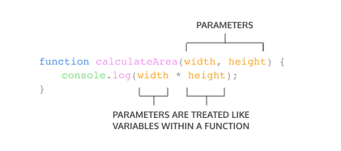
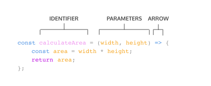
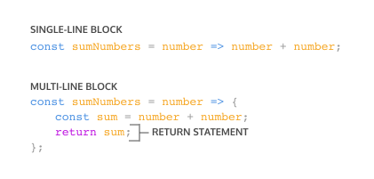

# Functions

## 1. What are Functions?
A function is a reusable block of code that groups together a sequence of statements to perform a specific task.

## 2. Function Declarations

In JavaScript, there are many ways to create a function. One way to create a function is by using a function declaration. A function declaration binds a function to a name, or an identifier.

A function declaration consists of:
- The function keyword.
- The name of the function, or its identifier, followed by parentheses.
- A function body, or the block of statements required to perform a specific task, enclosed in the function’s curly brackets, { }.

JavaScript Hoisting refers to the process whereby the interpreter appears to move the declaration of functions, variables or classes to the top of their scope, prior to execution of the code.


```
function greetWorld() {
  console.log('Hello, World!');
}

greetWorld(); // Output: Hello, World!
```

## 3. Calling a Function
To call a function in your code, you type the function name followed by parentheses.

This function call executes the function body, or all of the statements between the curly braces in the function declaration.


## 4. Parameters and Arguments
Parameters allow functions to accept input(s) and perform a task using the input(s).

The parameters are specified between the parenthesis and inside the function body, they act just like regular variables.

When calling a function that has parameters, we specify values called arguments, in the parentheses that follow the function name. Arguments can be passed to the function as values or variables.

The order in which arguments are passed and assigned follows the order that the parameters are declared.



```
function calculateArea(width, height) {
    console.log(width * height);
}

calculateArea(10,6); // width is 10, height is 6
```

## 5. Default Parameters
Default parameters allow parameters to have a predetermined value in case there is no argument passed into the function or if the argument is undefined when called.
```
function greeting (name = 'stranger') {
  console.log(`Hello, ${name}!`)
}
 
greeting('Nick') // Output: Hello, Nick!
greeting() // Output: Hello, stranger!
```

## 6. Return
To pass back information from the function call, we use a return statement. To create a return statement, we use the return keyword followed by the value that we wish to return. If the value is omitted, undefined is returned instead.
```
function rectangleArea(width, height) {
  if (width < 0 || height < 0) {
    return 'You need positive integers to calculate area!';
  }
  return width * height;
}
```

## 7. Helper Functions
We can also use the return value of a function inside another function. These functions being called within another function are often referred to as *helper functions*. Since each function is carrying out a specific task, it makes our code easier to read and debug if necessary.
```
function multiplyByNineFifths(number) {
  return number * (9/5);
};
 
function getFahrenheit(celsius) {
  return multiplyByNineFifths(celsius) + 32;
};
 
getFahrenheit(15); // Returns 59
```

## 8. Function Expressions
Another way to define a function is to use a function expression. To define a function inside an expression, we can use the `function` keyword. In a function expression, the function name is usually omitted. A function with no name is called an anonymous function. A function expression is often stored in a variable in order to refer to it.


```
const calculateArea = function(width, height) {
    const area = width * height;
    return area;
};

calculateArea(5, 4)
```
To declare a function expression:

1. Declare a variable to make the variable’s name be the name, or identifier, of your function. Since the release of ES6, it is common practice to use const as the keyword to declare the variable.

2. Assign as that variable’s value an anonymous function created by using the function keyword followed by a set of parentheses with possible parameters. Then a set of curly braces that contain the function body.

To invoke a function expression, write the name of the variable in which the function is stored followed by parentheses enclosing any arguments being passed into the function.

Unlike function declarations, function expressions are not hoisted so they cannot be called before they are defined.

## 9. Arrow Functions
Arrow function allows a shorter way to write functions by using the special “fat arrow” `() =>` notation.

Arrow functions remove the need to type out the keyword `function` every time you need to create a function. Instead, you first include the parameters inside the `( )` and then add an arrow `=>` that points to the function body surrounded in `{ }`:



```
const rectangleArea = (width, height) => {
  let area = width * height;
  return area;
};
```

## 10 Concise Body Arrow Functions
JavaScript also provides several ways to refactor arrow function syntax. The most condensed form of the function is known as concise body.

1. Functions that take only a single parameter do not need that parameter to be enclosed in parentheses. However, if a function takes zero or multiple parameters, parentheses are required.


2. A function body composed of a single-line block does not need curly braces. Without the curly braces, whatever that line evaluates will be automatically returned. The contents of the block should immediately follow the arrow => and the return keyword can be removed. This is referred to as implicit return.



Before refectoring
```
const squareNum = (num) => {
  return num * num;
};
```
After refactoring
```
const squareNum = num => num * num;
```